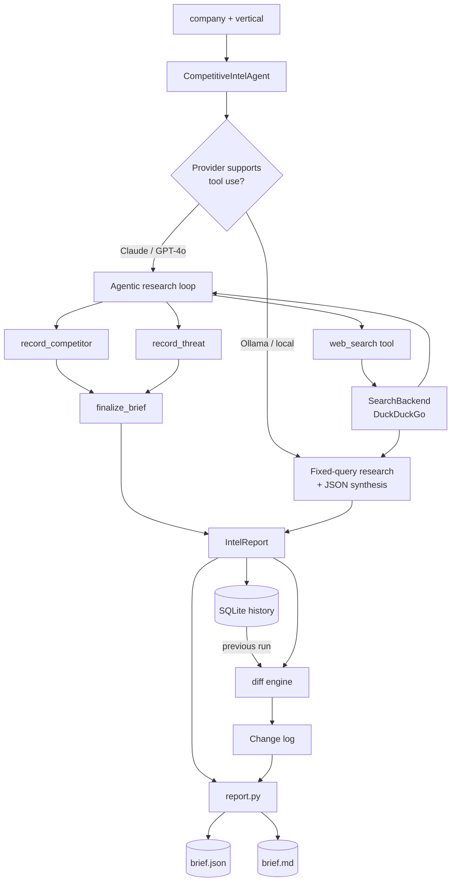

# Competitive Intelligence Agent

> Autonomous competitor research, on demand or on a schedule. Give it a company and
> a market; it researches the competition, writes an executive brief, and tells you
> **what changed since last time**.
>
> Built by **[Lumifie Consulting](https://github.com/jarvis2017/lumifie-ai-agents)** on [`lumifie-core`](../lumifie-core) • MIT licensed

## The Business Problem

Knowing what your competitors are doing is a permanent, low-grade chore that never
gets done well. A founder or marketer might check a rival's pricing page once, form
a mental snapshot, and then move on — while the market keeps shifting underneath
them. New entrants appear, incumbents reprice, positioning changes, and you find out
months later when a deal is lost to a competitor you didn't even know had launched.

Doing it properly is expensive. Manually researching a handful of competitors —
their positioning, pricing tiers, strengths, recent moves — and writing it up takes
a half-day of someone's time, and it's stale the moment it's finished. Paying an
analyst or an agency for ongoing competitive intelligence runs into the thousands
per month. So most businesses simply fly blind and react late.

This agent does the research for you and, crucially, **remembers**. Give it your
company name and your market; it searches the web, identifies your real competitors,
summarizes how each one positions and prices itself, rates the competitive threat,
and writes a one-page executive brief. Run it again next week or next month and the
brief opens with a "What Changed Since Last Run" section — new competitors, price
moves, repositioning, threat-level shifts — so you're never surprised again. Point it
at a cron schedule and it becomes a standing early-warning system for a few cents a run.

## Who This Is For

- **Founders & product leaders** tracking a fast-moving market
- **Marketing & competitive-enablement teams** keeping battlecards current
- **Sales teams** that need up-to-date competitor positioning and pricing
- **Investors / analysts** monitoring a portfolio company's landscape
- **Agencies** delivering competitive intelligence as a productized service

## How It Works



## Agent Architecture

| Module | Role | Inputs | Outputs | Tools / deps |
|---|---|---|---|---|
| `agent.py` | Agentic research loop + JSON fallback | company, vertical | `IntelReport` | `lumifie_core.LLMProvider`, `BaseAgent`, `web_search` tool |
| `search.py` | Web search behind a `SearchBackend` protocol (injectable) | query | `SearchResult[]` | `ddgs` (DuckDuckGo) |
| `store.py` | Persist every run, fetch latest prior run | `IntelReport` | run id / prior `IntelReport` | `sqlite3` |
| `diff.py` | Detect run-over-run changes | prev + current report | `Change[]` | — |
| `report.py` | Render brief (incl. change log) | report + changes | `.json`, `.md` | — |
| `models.py` | Typed outputs | tool inputs | `Competitor`, `Threat`, `IntelReport`, `Change` | `pydantic` |
| `config.py` | Settings (model, search limits, db path) | env / flags | `CompetitiveSettings` | `lumifie_core.CoreSettings` |
| `cli.py` | Entry point; research → diff → render | CLI args | brief files | `lumifie_core` |

**Tools the model is given:** `web_search`, `record_competitor`, `record_threat`,
`finalize_brief` (native on Claude/GPT-4o; JSON-mode synthesis on Ollama).

## Example Output

**JSON** (`examples/…brief.json`, abridged — report + change log):

```json
{
  "report": {
    "company": "Northwind Analytics",
    "vertical": "product analytics SaaS",
    "overall_threat_level": "high",
    "competitors": [
      { "name": "Amplitude", "positioning": "Enterprise product analytics leader", "pricing": "Usage-based; Growth tier from ~$49k/yr" }
    ],
    "threats": [
      { "severity": "high", "competitor": "PostHog", "recommendation": "Lead with warehouse-native integration; publish a TCO comparison vs. self-hosting PostHog." }
    ]
  },
  "changes": [
    { "kind": "new_competitor", "competitor": "PostHog", "summary": "New competitor identified: PostHog." },
    { "kind": "dropped_competitor", "competitor": "Heap", "summary": "Heap no longer appears in the landscape." }
  ]
}
```

**Markdown summary** (`examples/…brief.md`, excerpt):

```markdown
# Competitive Intelligence Brief — Northwind Analytics

**Overall competitive threat:** 🟠 High

## What Changed Since Last Run
- _new competitor_ — **PostHog**: New competitor identified: PostHog.
- _pricing change_ — **Mixpanel**: Free tier; Enterprise from ~$60k/yr (was ~$28/mo).
- _overall threat change_: Overall threat moved from Medium to High.
```

## Technical Stack


| Layer | Choice |
|---|---|
| Language | Python 3.12+ |
| Shared foundation | `lumifie-core` |
| LLM access | litellm — Claude, OpenAI, Ollama |
| Default model | `claude-opus-4-8` |
| Web search | DuckDuckGo via `ddgs` (no API key); injectable backend |
| Persistence / diff | SQLite (`sqlite3`) |
| Data models | Pydantic 2 |
| Tests / lint | pytest / ruff |

## Setup & Usage

You need Python 3.12+ and [uv](https://github.com/astral-sh/uv).

```bash
# 1. From the repo root, install the shared core (once):
uv pip install -e ./lumifie-core

# 2. Set up this agent:
cd competitive-intel-agent
uv venv --python 3.12
uv pip install -e ".[dev]"

# 3. Add your API key:
cp .env.example .env          # set ANTHROPIC_API_KEY=sk-ant-...
set -a; . ./.env; set +a

# 4. Run it:
competitive-intel --company "Northwind Analytics" \
                  --vertical "product analytics SaaS" \
                  --out-dir ./reports --print
```

Run it again later and the brief's **"What Changed Since Last Run"** section fills in
automatically from the SQLite history.

**Scheduled (cron):**

```bash
chmod +x scripts/run_scheduled.sh
# Every Monday 07:00:
# 0 7 * * 1 cd /opt/competitive-intel-agent && \
#   scripts/run_scheduled.sh "Northwind Analytics" "product analytics SaaS" >> /var/log/ci.log 2>&1
```

Run the offline test suite (no API key, no network): `pytest`

## Configuration

| Variable | Description | Default |
|---|---|---|
| `LITELLM_MODEL` | Model alias/id: `claude`, `gpt-4o`, `ollama/llama3.1`, … | `claude` |
| `ANTHROPIC_API_KEY` | Required for Claude models | — |
| `OPENAI_API_KEY` | Required for GPT models | — |
| `OLLAMA_API_BASE` | Ollama endpoint | `http://localhost:11434` |
| `LUMIFIE_MAX_TOKENS` | Max output tokens per call | `8000` |
| `LUMIFIE_MAX_RETRIES` | Retry attempts on transient API errors | `4` |
| `LUMIFIE_LOG_LEVEL` | Log level | `INFO` |
| `CI_DB_PATH` | SQLite history path (enables run-over-run diffs) | `competitive_intel.db` |
| `CI_SEARCH_REGION` | DuckDuckGo region | `us-en` |
| `CI_MAX_SEARCHES` | Max web searches per run | `8` |
| `CI_MAX_COMPETITORS` | Max competitors recorded | `8` |
| `CI_MAX_ITERS` | Max agent loop iterations | `14` |
| `CI_RESULTS_PER_SEARCH` | Results fetched per query | `5` |

## Supported Models

| Capability | Claude (`claude-opus-4-8`) | OpenAI (`gpt-4o`) | Ollama (`ollama/*`) |
|---|---|---|---|
| Agentic research loop | ✅ Full (tool use) | ✅ Full (tool use) | 🟡 Partial (fixed queries) |
| `web_search` tool calls | ✅ Full | ✅ Full | 🟡 Agent-issued, fixed set |
| Competitor / threat synthesis | ✅ Full | ✅ Full | 🟡 JSON mode |
| SQLite diff / change log | ✅ Full | ✅ Full | ✅ Full |
| Scheduled (cron) runs | ✅ Full | ✅ Full | ✅ Full |

**Full** = native tool use; **Partial** = JSON-mode / fixed-query fallback with a
logged warning.

## Limitations & Roadmap

**Limitations**

- Web results reflect what DuckDuckGo returns at run time; coverage varies by query.
- The agent reasons from search snippets, not full page reads — deep pricing detail
  behind logins or in PDFs may be missed.
- Output is informational; verify before acting on it.

**Roadmap**

- Full-page reads (fetch + parse competitor pricing/positioning pages).
- Pluggable premium search backends (Tavily, SerpAPI) behind the same protocol.
- Email/Slack delivery of the brief on each scheduled run.
- Trend charts across the full SQLite history (pricing over time, threat trajectory).

---

MIT © 2026 Lumifie Consulting.
