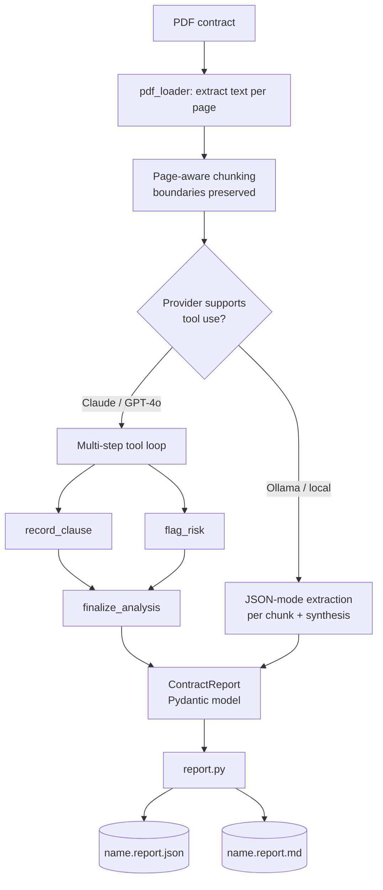

# Contract Intelligence Agent

> Reads a PDF contract, extracts and analyzes the clauses that carry real risk,
> and produces an executive risk report — in seconds, not hours.
>
> Built by **[Lumifie Consulting](https://github.com/jarvis2017/lumifie-ai-agents)** on [`lumifie-core`](../lumifie-core) • MIT licensed

## The Business Problem

Most small and mid-sized businesses sign contracts they haven't fully read. A
master services agreement, an NDA, or a vendor contract can run 20+ pages of dense
legal language, and the terms that actually hurt you — uncapped liability, an
auto-renewal you forget to cancel, the other side being able to walk away on 30
days' notice while you're locked in — are buried where a busy owner will never spot
them. Paying a lawyer to review every contract costs $300–$800 a pop and takes days;
skipping review means signing blind.

The result is a quiet, recurring tax on the business: bad terms get accepted because
nobody had the time or money to catch them, and the cost only shows up later — a
renewal that auto-charged, an indemnity claim with no ceiling, an IP clause that gave
away ownership of work you paid for.

This agent gives you a first-pass legal review in under a minute. Hand it a PDF and
it returns a plain-English summary, an overall risk rating, every key clause it
found (quoted verbatim, with page numbers), and a ranked list of risks — each with a
concrete recommendation for what to renegotiate before you sign. It doesn't replace
your lawyer; it makes sure you (and your lawyer) spend time on the contracts and
clauses that actually matter.

## Who This Is For

- **Founders & small-business owners** signing vendor, client, or partnership agreements without in-house counsel
- **Consultants, agencies & freelancers** reviewing MSAs and SOWs before every engagement
- **Procurement & operations teams** triaging a queue of supplier contracts
- **Paralegals & legal ops** wanting a fast first pass before attorney review
- **Anyone** who needs to understand a contract's risk profile before a deadline

## How It Works



The agent walks the contract one page-group at a time in a single running
conversation, so later sections are analyzed in the context of earlier ones and
large/multi-page PDFs never overflow the model's context window.

## Agent Architecture

| Module | Role | Inputs | Outputs | Tools / deps |
|---|---|---|---|---|
| `pdf_loader.py` | Extract text per page; group into context-sized chunks (page boundaries kept) | PDF path | `ContractDocument` (pages, chunks) | `pypdf` |
| `agent.py` | Multi-step analysis loop; tool path + JSON fallback | `ContractDocument` | `ContractReport` | `lumifie_core.LLMProvider`, `BaseAgent` |
| `tools.py` | Function-tool schemas + JSON-mode hints | — | tool defs | `lumifie_core.chat` |
| `models.py` | Typed output models | tool inputs | `Clause`, `Risk`, `ContractReport` | `pydantic` |
| `report.py` | Render JSON + executive Markdown | `ContractReport` | `.json`, `.md` strings | — |
| `config.py` | Settings (model, chunking, retries) | env / flags | `ContractSettings` | `lumifie_core.CoreSettings` |
| `cli.py` | Entry point; orchestration | CLI args | report files | `lumifie_core` |

**Tools the model is given:** `record_clause`, `flag_risk`, `finalize_analysis`
(native function calling on Claude/GPT-4o; JSON-mode structured extraction on Ollama).

## Example Output

**JSON** (`examples/sample_contract.report.json`, abridged):

```json
{
  "contract_name": "sample_contract.pdf",
  "overall_risk_level": "high",
  "executive_summary": "This Master Services Agreement is materially vendor-favorable...",
  "risks": [
    {
      "severity": "critical",
      "category": "liability",
      "title": "Uncapped client indemnification",
      "recommendation": "Cap total indemnity at fees paid in the trailing 12 months and make the carve-out mutual; require Provider indemnity for IP infringement."
    }
  ],
  "clauses": [
    { "category": "payment_terms", "title": "Net-15 payment, non-refundable", "page": 1 }
  ]
}
```

**Markdown summary** (`examples/sample_contract.report.md`, excerpt):

```markdown
# Contract Analysis — sample_contract.pdf

**Overall risk:** 🟠 High
**Pages analyzed:** 3

## Risk Register
_5 risk(s) identified: 1 critical, 2 high, 2 medium._

### 1. 🔴 Critical — Uncapped client indemnification
*Category: Liability*

Section 5.2 makes the client's indemnity explicitly unlimited and carves it out of
the mutual limitation-of-liability cap...

**Recommendation:** Cap total indemnity at fees paid in the trailing 12 months and
make the carve-out mutual.
```

## Technical Stack


| Layer | Choice |
|---|---|
| Language | Python 3.12+ |
| Shared foundation | `lumifie-core` (provider, logging, retries, base agent) |
| LLM access | litellm — Claude, OpenAI, Ollama |
| Default model | `claude-opus-4-8` |
| PDF parsing | `pypdf` |
| Data models | Pydantic 2 |
| Logging / retries | loguru / tenacity |
| Vector DB | none (not needed) |
| Tests / lint | pytest / ruff |

## Setup & Usage

You need Python 3.12+ and [uv](https://github.com/astral-sh/uv).

```bash
# 1. From the repo root, install the shared core (once):
uv pip install -e ./lumifie-core

# 2. Set up this agent:
cd contract-intelligence-agent
uv venv --python 3.12
uv pip install -e ".[dev]"

# 3. Add your API key:
cp .env.example .env          # edit .env, set ANTHROPIC_API_KEY=sk-ant-...
set -a; . ./.env; set +a      # load it into your shell

# 4. Generate the sample contract (or bring your own PDF), then analyze it:
python scripts/make_sample_pdf.py examples/sample_contract.pdf
contract-intelligence examples/sample_contract.pdf --out-dir ./reports --print
```

This writes `reports/sample_contract.report.json` and `.report.md`.

```
contract-intelligence <pdf> [--out-dir DIR] [--model claude|gpt-4o|ollama/llama3.1]
                            [--reasoning-effort low|medium|high] [--print]
```

Run the offline test suite (no API key needed): `pytest`

## Configuration

All settings are environment variables (see `.env.example`); CLI flags override them.

| Variable | Description | Default |
|---|---|---|
| `LITELLM_MODEL` | Model alias/id: `claude`, `gpt-4o`, `ollama/llama3.1`, … | `claude` |
| `ANTHROPIC_API_KEY` | Required for Claude models | — |
| `OPENAI_API_KEY` | Required for GPT models | — |
| `OLLAMA_API_BASE` | Ollama endpoint (local models) | `http://localhost:11434` |
| `LUMIFIE_MAX_TOKENS` | Max output tokens per call | `8000` |
| `LUMIFIE_TEMPERATURE` | Sampling temperature (only sent if set) | unset |
| `LUMIFIE_REASONING_EFFORT` | `low`/`medium`/`high` (only if supported) | unset |
| `LUMIFIE_MAX_RETRIES` | Retry attempts on transient API errors | `4` |
| `LUMIFIE_REQUEST_TIMEOUT` | Per-request timeout (seconds) | `600` |
| `LUMIFIE_LOG_LEVEL` | `DEBUG`/`INFO`/`WARNING`/`ERROR` | `INFO` |
| `CONTRACT_AGENT_MAX_CHUNK_CHARS` | Approx. characters per chunk | `12000` |
| `CONTRACT_AGENT_MAX_ITERS` | Max tool iterations per chunk | `8` |

## Supported Models

| Capability | Claude (`claude-opus-4-8`) | OpenAI (`gpt-4o`) | Ollama (`ollama/*`) |
|---|---|---|---|
| Clause extraction | ✅ Full (tool use) | ✅ Full (tool use) | 🟡 Partial (JSON mode) |
| Risk flagging | ✅ Full | ✅ Full | 🟡 Partial |
| Multi-step loop | ✅ Full | ✅ Full | 🟡 Single-pass per chunk |
| Page-aware chunking | ✅ Full | ✅ Full | ✅ Full |
| Reasoning effort | ✅ Full | 🟡 Partial | ⚪ Experimental |

**Full** = native tool use; **Partial** = JSON-mode fallback with a logged warning;
**Experimental** = works but unverified across model versions.

## Limitations & Roadmap

**Limitations**

- **No OCR.** Scanned-image PDFs with no text layer are rejected with a clear error.
- **Not legal advice.** This is a first-pass aid, not a substitute for an attorney.
- Analysis quality tracks the chosen model; local models give a lighter review.

**Roadmap**

- Redline-style suggested edits for each flagged clause.
- A reusable clause/risk knowledge base for consistent scoring across contracts.
- Batch mode for reviewing a folder of contracts with a portfolio risk summary.
- Optional citation back to exact character offsets in the source PDF.

---

MIT © 2026 Lumifie Consulting.
