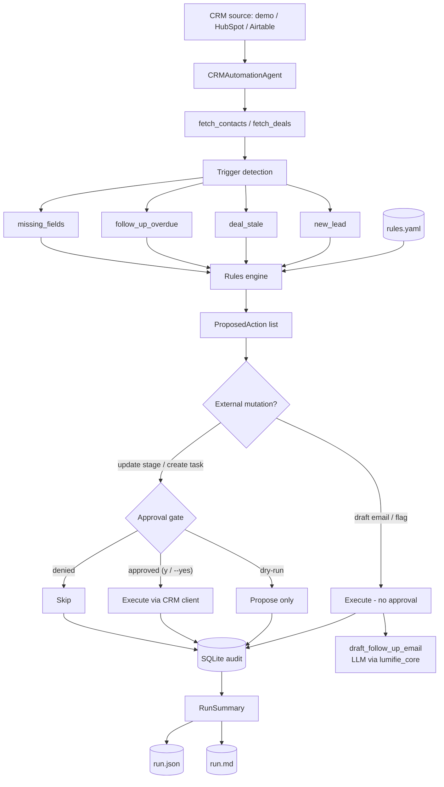

# CRM Automation Agent

> Your CRM, kept tidy and followed-up — automatically, but never out of your control.
> Point it at HubSpot or Airtable; it watches for new leads, stalled deals, overdue
> follow-ups, and missing details, then drafts emails, schedules tasks, and flags
> records **for your approval** — auditing every step.
>
> Built by **[Lumifie Consulting](https://github.com/jarvis2017/lumifie-ai-agents)** on [`lumifie-core`](../lumifie-core) • MIT licensed

## The Business Problem

A CRM is only as good as the work people remember to do in it. Leads come in and sit
uncontacted for days. Deals go quiet and quietly die because nobody followed up at the
right moment. Follow-up dates slip past unnoticed. Contact records are half-filled, so
the next person who picks them up has no phone number and no company. None of this is
hard — it's just relentless, and it's the first thing to fall through the cracks when a
small team is busy actually selling.

Hiring a sales operations person to babysit the pipeline is expensive, and most
businesses can't justify it. So the work doesn't get done consistently, revenue leaks
out of the funnel, and nobody can say exactly where or why. The cost is invisible until
you add it up: a stalled $48k deal here, a new lead that went cold there, a renewal
nobody chased.

This agent is a tireless sales-ops assistant that watches your CRM and acts on simple
rules **you** write in plain language. New lead? It drafts a warm intro email for you to
review. Deal gone quiet for a month? It drafts a check-in. Follow-up overdue? It queues a
task. Contact missing key fields? It flags it. Crucially, anything that actually changes
your CRM — moving a deal, creating a task — **asks for your approval first**, and emails
are always drafts you review, never auto-sent. Every decision is written to an audit log,
so you have a complete record of what was proposed, approved, and done.

## Who This Is For

- **Founders & small sales teams** without a dedicated sales-ops person
- **Sales managers** who want consistent follow-up and a clean pipeline
- **RevOps / CRM admins** enforcing data-hygiene and follow-up SLAs
- **Agencies & consultants** managing client pipelines in HubSpot or Airtable
- **Anyone** who has lost a deal because a follow-up slipped through the cracks

## How It Works



## Agent Architecture

| Module | Role | Inputs | Outputs | Tools / deps |
|---|---|---|---|---|
| `agent.py` | Orchestrates fetch → detect → match → gate → execute → audit | source, dry_run | `RunSummary` | `lumifie_core.BaseAgent`, `LLMProvider` |
| `crm/` | CRM clients behind a `CRMClient` protocol (injectable) | — | `Contact[]`, `Deal[]`; mutations | `httpx` (HubSpot, Airtable); in-memory fake |
| `triggers.py` | Detect trigger conditions from records | contacts, deals, params | `Trigger[]` | — |
| `rules.py` | Load/validate YAML rules; match triggers → actions | rules file, records | `ProposedAction[]` | `pyyaml`, `pydantic` |
| `actions.py` | Execute a proposed action (incl. LLM email draft) | `ProposedAction` | result string | `lumifie_core` (drafts), CRM client |
| `approval.py` | Human approval gate (injectable callable) | `ProposedAction` | approve/deny | — |
| `audit.py` | SQLite audit trail of every decision | `AuditEntry` | persisted rows | `sqlite3` |
| `report.py` | Render run summary | `RunSummary` | `.json`, `.md` | — |
| `models.py` | Typed records, triggers, actions, audit | — | Pydantic models | `pydantic` |
| `config.py` | Settings (model, source, db, rules path) | env / flags | `CRMSettings` | `lumifie_core.CoreSettings` |
| `cli.py` | Entry point; build → run → report | CLI args | exit code, report | `lumifie_core` |

**Action types:** `draft_follow_up_email` (LLM draft, never sent), `update_deal_stage`
and `create_task` (external mutations, human-gated), `flag_for_review` (audited only).

## Example Output

**JSON** (`examples/example_run.json`, abridged — a dry-run on the demo source):

```json
{
  "source": "demo",
  "dry_run": true,
  "contacts_scanned": 3,
  "deals_scanned": 4,
  "triggers": [
    { "type": "deal_stale", "target_id": "d-2001", "detail": "Deal 'BrightPath — Platform license' has had no activity for 40 days." }
  ],
  "audit": [
    { "rule_name": "Task on overdue follow-ups", "action_type": "create_task", "target_id": "d-2002", "decision": "proposed", "result": "Dry run: proposed only, not executed." }
  ]
}
```

**Markdown summary** (`examples/example_run.md`, excerpt):

```markdown
# CRM Automation Run

**Source:** demo  •  **Mode:** Dry run (nothing executed)

## Triggers Detected
| Type | Target | Detail |
|---|---|---|
| deal_stale | d-2001 | Deal 'BrightPath — Platform license' has had no activity for 40 days. |

## Proposed Actions & Decisions
| Rule | Action | Target | Decision | Result |
|---|---|---|---|---|
| Re-engage stale deals | draft_follow_up_email | d-2001 | 📋 Proposed | Dry run: proposed only, not executed. |
```

## Technical Stack


| Layer | Choice |
|---|---|
| Language | Python 3.12+ |
| Shared foundation | `lumifie-core` |
| LLM access | litellm — Claude, OpenAI, Ollama |
| Default model | `claude-opus-4-8` |
| CRM integrations | HubSpot CRM v3, Airtable REST (via `httpx`); injectable + offline fake |
| Rules | YAML (`pyyaml`) — editable by non-technical users |
| Audit / persistence | SQLite (`sqlite3`) |
| Data models | Pydantic 2 |
| Tests / lint | pytest / ruff |

## Setup & Usage

You need Python 3.12+ and [uv](https://github.com/astral-sh/uv).

```bash
# 1. From the repo root, install the shared core (once):
uv pip install -e ./lumifie-core

# 2. Set up this agent:
cd crm-automation-agent
uv venv --python 3.12
uv pip install -e ".[dev]"

# 3. Try it immediately — no credentials needed (offline demo data):
crm-automation run --source demo --dry-run --print

# 4. For a real CRM, add your keys:
cp .env.example .env          # set ANTHROPIC_API_KEY + HUBSPOT_TOKEN or Airtable keys
set -a; . ./.env; set +a
```

**The approval gate:**

```bash
# Propose + audit only — nothing executes, no prompts:
crm-automation run --source hubspot --dry-run

# Default — prompts y/N before each external action (update stage / create task):
crm-automation run --source hubspot

# Unattended automation — auto-approve every external action (still audited):
crm-automation run --source hubspot --yes
```

Email drafts and flags never touch your CRM, so they need no approval — they are
queued for review in the run report. Run the offline test suite (no keys, no
network): `pytest`.

**Editing the rules** (no code required): open `config/rules.example.yaml` and change
thresholds (e.g. how many days makes a deal "stale"), required fields, or which
actions fire. Each rule is commented in plain English.

**Scheduled (cron):**

```bash
chmod +x scripts/run_scheduled.sh
# Every weekday 08:00, auto-approving and logging:
# 0 8 * * 1-5 cd /opt/crm-automation-agent && \
#   scripts/run_scheduled.sh hubspot >> /var/log/crm-automation.log 2>&1
```

## Configuration

| Variable | Description | Default |
|---|---|---|
| `LITELLM_MODEL` | Model alias/id: `claude`, `gpt-4o`, `ollama/llama3.1`, … | `claude` |
| `ANTHROPIC_API_KEY` | Required for Claude models (not for `--source demo`) | — |
| `OPENAI_API_KEY` | Required for GPT models | — |
| `OLLAMA_API_BASE` | Ollama endpoint | `http://localhost:11434` |
| `LUMIFIE_MAX_TOKENS` | Max output tokens per call | `8000` |
| `LUMIFIE_MAX_RETRIES` | Retry attempts on transient API errors | `4` |
| `LUMIFIE_LOG_LEVEL` | Log level | `INFO` |
| `CRM_SOURCE` | CRM source: `demo`, `hubspot`, `airtable` | `demo` |
| `CRM_RULES_PATH` | Path to the YAML rules file | `config/rules.example.yaml` |
| `CRM_DB_PATH` | SQLite audit trail path | `crm_audit.db` |
| `HUBSPOT_TOKEN` | HubSpot private-app token (for `--source hubspot`) | — |
| `AIRTABLE_API_KEY` | Airtable personal access token (for `--source airtable`) | — |
| `AIRTABLE_BASE_ID` | Airtable base id | — |
| `AIRTABLE_CONTACTS_TABLE` | Airtable contacts table name | `Contacts` |
| `AIRTABLE_DEALS_TABLE` | Airtable deals table name | `Deals` |
| `AIRTABLE_TASKS_TABLE` | Airtable tasks table name | `Tasks` |

## Supported Models

| Capability | Claude (`claude-opus-4-8`) | OpenAI (`gpt-4o`) | Ollama (`ollama/*`) |
|---|---|---|---|
| Trigger detection & rules engine | ✅ Full (deterministic) | ✅ Full | ✅ Full |
| Human approval gate & audit | ✅ Full | ✅ Full | ✅ Full |
| Email-draft generation | ✅ Full (tool use) | ✅ Full (tool use) | 🟡 Partial (JSON mode) |
| Offline demo (`--source demo`) | ✅ Full (stub provider) | ✅ Full | ✅ Full |
| HubSpot / Airtable actions | ✅ Full | ✅ Full | ✅ Full |

**Full** = native tool use; **Partial** = JSON-mode fallback with a logged warning.
Detection, rules, gating, and auditing are deterministic and model-independent — the
LLM is used only to write email drafts.

## Limitations & Roadmap

**Limitations**

- Triggers are rule-based on the fields the CRM exposes; it doesn't read email threads
  or call transcripts to judge intent.
- Email drafts are always drafts — the agent never sends mail (by design).
- The HubSpot/Airtable clients cover the common read/action surface, not every object
  type or custom property.
- Output and drafts are assistive; review before approving actions.

**Roadmap**

- Pipedrive and Salesforce clients behind the same `CRMClient` protocol.
- Slack/email digest of the proposed-actions queue for one-click approval.
- Richer triggers (deal-velocity drop, sentiment from logged notes).
- Optional send-after-approval for drafted emails, with a configurable allowlist.
- Per-rule run history and trend charts across the SQLite audit trail.

---

MIT © 2026 Lumifie Consulting.
