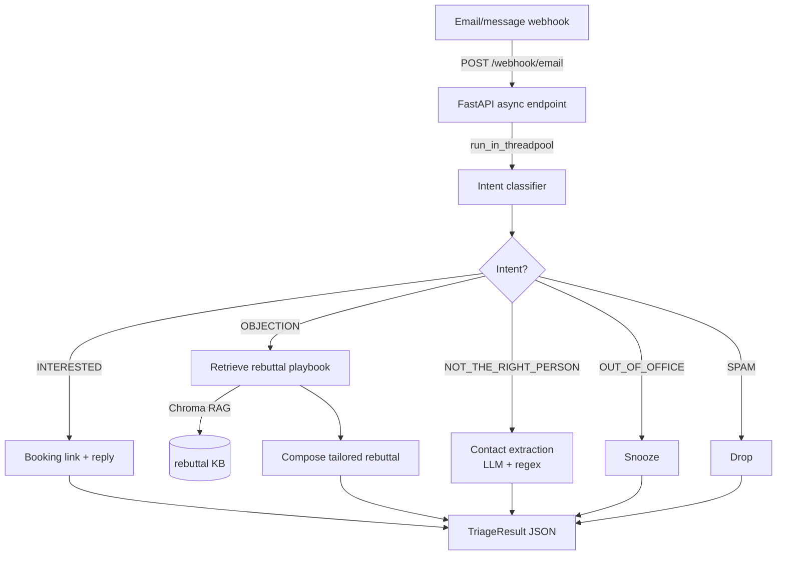

# Inbound Triage Agent

> A webhook that reads every reply to your outreach, figures out what the person
> actually means, and takes the right next step automatically — objections get a
> rebuttal, interested replies get a booking link, wrong-person replies get the
> real contact pulled out.
>
> Built by **[Lumifie Consulting](https://github.com/jarvis2017/lumifie-ai-agents)** on [`lumifie-core`](../lumifie-core) • MIT licensed

## The Business Problem

When outreach works, replies start coming back — and most of them never get handled
well. A busy founder or rep faces an inbox full of "too expensive," "I'm not the
right person, talk to Jane," "I'm out until the 30th," "sounds great, let's talk,"
and outright spam, all mixed together. The good ones (interested, or a referral to
the actual decision-maker) are exactly the ones that get buried and go cold, because
triaging them by hand is tedious and easy to deprioritize.

Every reply that sits unanswered is money left on the table. An "interested" that
waits two days loses momentum. A "wrong person" reply that contains the decision-
maker's name and email gets archived instead of acted on. An objection that could be
turned around with a thoughtful response gets a generic reply, or none.

This agent sits behind your email/CRM webhook and triages every inbound reply the
moment it arrives. It classifies the intent, then routes automatically: an objection
gets a tailored rebuttal drafted from your own playbook (retrieved with RAG), an
interested reply gets a booking link and a warm response, a wrong-person reply gets
the referred contact's name, email, and phone extracted for you, out-of-office gets
snoozed, and spam gets dropped. Your team wakes up to a sorted inbox with the next
action already prepared.

## Who This Is For

- **Founders & sales teams** running outbound who can't babysit the reply inbox
- **SDR/BDR teams** that need consistent, fast objection handling and lead routing
- **RevOps** wiring reply-handling into an existing CRM/email stack via webhooks
- **Agencies** operating outreach on behalf of many clients
- **Customer-facing teams** that want auto-triage of any inbound message stream

## How It Works



The model calls are synchronous, so the async endpoint offloads them to a threadpool
to stay responsive under concurrent webhooks.

## Agent Architecture

| Module | Role | Inputs | Outputs | Tools / deps |
|---|---|---|---|---|
| `api.py` | Async FastAPI webhook + `/health` | `InboundMessage` JSON | `TriageResult` JSON | `fastapi` |
| `agent.py` | Classify → route to the right action | `InboundMessage` | `TriageResult` | `lumifie_core` |
| `knowledge.py` | RAG rebuttal store (objection → playbook) | objection text | top-k entries | `chromadb` (offline hashing embedding) |
| `contacts.py` | Regex email/phone extraction (augments LLM/NER) | text | emails, phones | stdlib `re` |
| `stub.py` | Offline rule-based provider for zero-setup demo | messages | `CompletionResult` | — |
| `factory.py` | Build agent; stub when no credential | settings | agent | `lumifie_core` |
| `models.py` | Typed models + JSON schemas | — | Pydantic models | `pydantic` |
| `config.py` | Settings (booking URL, KB path, top-k) | env | `TriageSettings` | `lumifie_core.CoreSettings` |
| `cli.py` / `main.py` | `--mock-email` demo and `--serve` | CLI args | console / server | — |

Classification and contact extraction use native tool use where supported, JSON-mode
fallback otherwise (via `lumifie_core.BaseAgent.structured`).

## Example Output

Run `python main.py --mock-email` (no key needed). For each message you get a
`TriageResult`. **JSON** (`examples/example_triage.json`, abridged):

```json
[
  {
    "message_id": "msg_interested_01",
    "intent": "INTERESTED",
    "action": "booking",
    "booking": { "link": "https://cal.com/lumifie/intro?ref=msg_interested_01" }
  },
  {
    "message_id": "msg_objection_01",
    "intent": "OBJECTION",
    "action": "rebuttal",
    "rebuttal": { "sources": ["price", "incumbent", "timing"] }
  },
  {
    "message_id": "msg_wrongperson_01",
    "intent": "NOT_THE_RIGHT_PERSON",
    "action": "extract_contact",
    "contact": {
      "referred_name": "Jordan Mills",
      "emails": ["jordan.mills@vertexlabs.com"],
      "phones": ["415-555-0142"]
    }
  }
]
```

**Markdown summary** (`examples/example_triage.md`, excerpt):

```markdown
## msg_objection_01 → OBJECTION → `rebuttal`
- **Rebuttal** (KB sources: price, incumbent, timing):
  > Thanks for the candid reply — totally fair. A quick thought before you go...
```

## Technical Stack


| Layer | Choice |
|---|---|
| Language | Python 3.12+ |
| Shared foundation | `lumifie-core` |
| API | FastAPI (async) + uvicorn |
| LLM access | litellm — Claude, OpenAI, Ollama |
| Default model | `claude-opus-4-8` |
| Vector DB | **Chroma** (in-memory; deterministic offline embedding) |
| NER / extraction | LLM structured output + regex augmentation |
| Tests / lint | pytest + FastAPI TestClient / ruff |

## Setup & Usage

You need Python 3.12+ and [uv](https://github.com/astral-sh/uv).

```bash
# See it work IMMEDIATELY — no API key, no install required:
python main.py --mock-email

# Full setup:
uv pip install -e ../lumifie-core        # shared core (once)
cd inbound-triage-agent
uv venv --python 3.12
uv pip install -e ".[dev]"

# Run the webhook server:
python main.py --serve --port 8000
# then POST a message:
curl -s localhost:8000/webhook/email -H 'content-type: application/json' \
  -d '{"id":"1","sender":"a@b.com","subject":"re","body":"Too expensive, we already use a competitor."}'
```

`python main.py --mock-email` runs against `data/mock_email.json` (five messages, one
per intent). With no API key it uses a built-in **offline rule-based provider** so it
works instantly; set `ANTHROPIC_API_KEY` (or another) to use a real model.

Run the offline test suite: `pytest`

## Configuration

| Variable | Description | Default |
|---|---|---|
| `LITELLM_MODEL` | Model alias/id: `claude`, `gpt-4o`, `ollama/llama3.1`, … | `claude` |
| `ANTHROPIC_API_KEY` | Required for Claude models (omit to use offline stub) | — |
| `OPENAI_API_KEY` | Required for GPT models | — |
| `OLLAMA_API_BASE` | Ollama endpoint | `http://localhost:11434` |
| `LUMIFIE_MAX_TOKENS` | Max output tokens per call | `8000` |
| `LUMIFIE_MAX_RETRIES` | Retry attempts on transient API errors | `4` |
| `LUMIFIE_LOG_LEVEL` | Log level | `INFO` |
| `TRIAGE_BOOKING_URL` | Base URL for generated booking links | `https://cal.com/lumifie/intro` |
| `TRIAGE_KB_PATH` | Custom rebuttal playbook JSON (blank = built-in) | unset |
| `TRIAGE_REBUTTAL_TOP_K` | Rebuttal snippets retrieved per objection | `3` |

## Supported Models

| Capability | Claude (`claude-opus-4-8`) | OpenAI (`gpt-4o`) | Ollama (`ollama/*`) | Offline stub |
|---|---|---|---|---|
| Intent classification | ✅ Full (tool use) | ✅ Full (tool use) | 🟡 Partial (JSON) | ✅ Rule-based |
| RAG rebuttal | ✅ Full | ✅ Full | 🟡 Partial | ✅ Templated |
| Contact extraction | ✅ Full + regex | ✅ Full + regex | 🟡 Partial + regex | ✅ Regex |
| Booking routing | ✅ Full | ✅ Full | ✅ Full | ✅ Full |
| Async webhook | ✅ Full | ✅ Full | ✅ Full | ✅ Full |

**Full** = native tool use; **Partial** = JSON-mode fallback with a logged warning;
**Offline stub** = the zero-setup rule-based provider used when no key is configured.

## Limitations & Roadmap

**Limitations**

- The offline stub is keyword-based — fine for the demo and tests, but use a real
  model for nuanced classification in production.
- Chroma runs in-memory with a deterministic hashing embedding (no semantic model)
  by default; swap in a real embedding for stronger objection recall.
- It drafts replies and booking links; it does not send email or write to your CRM —
  that integration is intentionally left to the deploying team.

**Roadmap**

- Real embedding function + persistent Chroma for a richer rebuttal playbook.
- Webhook signature verification and provider adapters (Gmail, Outlook, SendGrid).
- Auto-send + CRM write-back behind a human-approval toggle.
- A `SENTIMENT`/`UNSUBSCRIBE` intent and per-intent analytics.

---

MIT © 2026 Lumifie Consulting.
