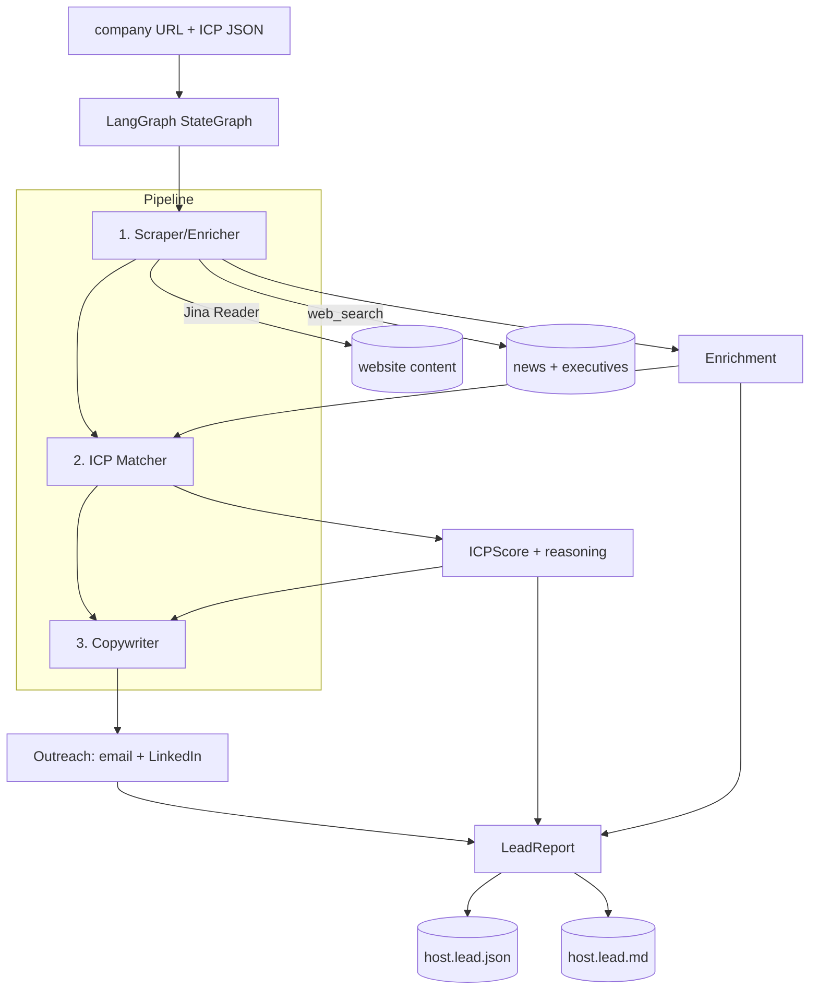

# Lead Research Agent

> Point it at a prospect's website. Three sub-agents research the company, score it
> against your ideal-customer profile, and draft a personalized email + LinkedIn
> message — grounded in live signals, not templates.
>
> Built by **[Lumifie Consulting](https://github.com/jarvis2017/lumifie-ai-agents)** on [`lumifie-core`](../lumifie-core) • MIT licensed

## The Business Problem

Good outbound sales is research-heavy and most reps don't have time for it. Doing it
right means visiting the prospect's site, figuring out what they actually sell,
checking for recent news or funding, identifying the right person to contact, judging
whether they're even a fit for what you offer, and only then writing something
personal enough to get a reply. Done by hand, that's 15–30 minutes per lead — so it
gets skipped, and reps blast generic templates that get ignored.

The cost shows up twice. First in wasted time: a rep researching 20 leads a day burns
hours that could be spent in conversations. Second in wasted pipeline: untargeted,
impersonal outreach has dismal reply rates, which means more leads burned to hit the
same number of meetings, and a sender reputation that degrades with every "who is
this?" reply.

This agent does the research and the first draft for you. Give it a company URL and
it reads the site, pulls recent news and the leadership team from the web, scores the
company against a configurable ideal-customer profile (with its reasoning), and writes
a tailored email and LinkedIn message built on the specific signals it found. A rep
gets a ready-to-personalize draft and a fit score in seconds instead of half an hour —
so they can spend their time on the leads that are actually worth it.

## Who This Is For

- **Founders & SDRs/AEs** doing targeted outbound without a research team
- **Agencies & lead-gen shops** producing personalized outreach at volume
- **RevOps teams** that want consistent, ICP-scored lead qualification
- **Growth marketers** building account-based outreach lists
- **Recruiters** (swap the ICP for a hiring profile) researching target companies

## How It Works



Each stage is a node in a LangGraph `StateGraph`; sources accumulate across nodes via
a state reducer, and every sub-agent returns a **Pydantic-validated** structured object.

## Agent Architecture

| Sub-agent / module | Role | Inputs | Outputs | Tools / deps |
|---|---|---|---|---|
| **Scraper/Enricher** (`scrape_node`) | Read the site + search news/executives; extract value prop, news, leaders | URL | `Enrichment` | `JinaReader`, `web_search`, `LLMProvider` |
| **ICP Matcher** (`match_node`) | Score company vs. ICP with reasoning | `Enrichment` + ICP | `ICPScore` | `LLMProvider` |
| **Copywriter** (`copy_node`) | Draft personalized email + LinkedIn from live signals | `Enrichment` + `ICPScore` | `Outreach` | `LLMProvider` |
| `graph.py` | LangGraph wiring (scrape → match → copywrite) | state | compiled graph | `langgraph` |
| `backends.py` | Web search + URL reader behind injectable protocols | query / URL | results / text | `ddgs`, `httpx` |
| `icp.py` | Configurable ICP (JSON) + default | JSON path | `ICPProfile` | `pydantic` |
| `models.py` | Structured outputs + JSON schemas | — | Pydantic models | `pydantic` |
| `report.py` | Render JSON + Markdown brief | `LeadReport` | `.json`, `.md` | — |
| `agent.py` / `cli.py` | Orchestrate the graph; entry point | URL, ICP | brief files | `lumifie_core` |

Structured extraction uses native tool use on Claude/GPT-4o and a JSON-mode fallback
on Ollama (via `lumifie_core.BaseAgent.structured`).

## Example Output

**JSON** (`examples/acme-analytics.lead.json`, abridged):

```json
{
  "company_url": "https://acme-analytics.com",
  "icp_name": "B2B SaaS — mid-market",
  "enrichment": {
    "company_name": "Acme Analytics",
    "value_proposition": "Warehouse-native product analytics for mid-market teams.",
    "recent_news": ["Raised a $20M Series B led by Acme Ventures (May 2026)"],
    "key_executives": [{ "name": "Jane Doe", "title": "CEO & Co-founder" }]
  },
  "icp_score": { "fit_score": 84, "tier": "Strong", "disqualified": false },
  "outreach": {
    "email_subject": "Congrats on the Series B — a thought on scaling Acme's tooling",
    "personalization_signals": ["$20M Series B (May 2026)", "new VP Engineering hire"]
  }
}
```

**Markdown summary** (`examples/acme-analytics.lead.md`, excerpt):

```markdown
# Lead Research — Acme Analytics

**ICP fit:** 🟢 Strong (84/100) — tier Strong

## Outreach
**Email**
_Subject:_ Congrats on the Series B — a thought on scaling Acme's tooling

Hi Jane, Congrats on the $20M Series B — and on bringing Sam in to lead engineering...
```

## Technical Stack


| Layer | Choice |
|---|---|
| Language | Python 3.12+ |
| Shared foundation | `lumifie-core` |
| Orchestration | **LangGraph** (`StateGraph`, 3-node pipeline) |
| LLM access | litellm — Claude, OpenAI, Ollama |
| Default model | `claude-opus-4-8` |
| Web search | DuckDuckGo via `ddgs` (injectable) |
| Page reader | Jina Reader (`r.jina.ai`) via `httpx` (injectable) |
| Structured outputs | Pydantic 2 (tool use / JSON fallback) |
| Vector DB | none |
| Tests / lint | pytest / ruff |

## Setup & Usage

You need Python 3.12+ and [uv](https://github.com/astral-sh/uv).

```bash
# 1. From the repo root, install the shared core (once):
uv pip install -e ./lumifie-core

# 2. Set up this agent:
cd lead-research-agent
uv venv --python 3.12
uv pip install -e ".[dev]"

# 3. Add your API key:
cp .env.example .env          # set ANTHROPIC_API_KEY=sk-ant-...
set -a; . ./.env; set +a

# 4. Research a lead (uses the built-in ICP, or pass your own JSON):
lead-research https://some-company.com --icp config/icp.example.json --out-dir ./reports --print
```

This writes `reports/<host>.lead.json` and `.lead.md`.

```
lead-research <url> [--icp PATH] [--out-dir DIR]
                    [--model claude|gpt-4o|ollama/llama3.1] [--region us-en] [--print]
```

Run the offline test suite (no API key, no network): `pytest`

## Configuration

| Variable | Description | Default |
|---|---|---|
| `LITELLM_MODEL` | Model alias/id: `claude`, `gpt-4o`, `ollama/llama3.1`, … | `claude` |
| `ANTHROPIC_API_KEY` | Required for Claude models | — |
| `OPENAI_API_KEY` | Required for GPT models | — |
| `OLLAMA_API_BASE` | Ollama endpoint | `http://localhost:11434` |
| `LUMIFIE_MAX_TOKENS` | Max output tokens per call | `8000` |
| `LUMIFIE_MAX_RETRIES` | Retry attempts on transient API errors | `4` |
| `LUMIFIE_LOG_LEVEL` | Log level | `INFO` |
| `LEAD_ICP_PATH` | Path to a custom ICP JSON (blank = built-in default) | unset |
| `LEAD_SEARCH_REGION` | DuckDuckGo region | `us-en` |
| `LEAD_MAX_SEARCHES` | Max web searches in the scrape stage | `4` |
| `LEAD_RESULTS_PER_SEARCH` | Results fetched per query | `4` |
| `LEAD_JINA_BASE` | Jina Reader base URL | `https://r.jina.ai` |
| `LEAD_MAX_PAGE_CHARS` | Max characters of page content used | `6000` |

## Supported Models

| Capability | Claude (`claude-opus-4-8`) | OpenAI (`gpt-4o`) | Ollama (`ollama/*`) |
|---|---|---|---|
| Enrichment extraction | ✅ Full (tool use) | ✅ Full (tool use) | 🟡 Partial (JSON mode) |
| ICP scoring + reasoning | ✅ Full | ✅ Full | 🟡 Partial |
| Outreach copywriting | ✅ Full | ✅ Full | 🟡 Partial (lighter copy) |
| LangGraph orchestration | ✅ Full | ✅ Full | ✅ Full |
| Web search / page reading | ✅ Full | ✅ Full | ✅ Full |

**Full** = native tool use; **Partial** = JSON-mode fallback with a logged warning.

## Limitations & Roadmap

**Limitations**

- Quality depends on what's publicly readable; sites that block the reader or have
  thin content yield weaker enrichment.
- The agent does not send email or connect on LinkedIn — it drafts; a human reviews
  and sends.
- No deduplication across runs yet; each URL is researched fresh.

**Roadmap**

- Conditional graph edge to skip copywriting for disqualified leads.
- CRM push (HubSpot/Salesforce) and CSV batch input for lists of URLs.
- Pluggable enrichment providers (Apollo/Clearbit) behind the search protocol.
- A/B variants of the outreach copy and a deliverability/spam check.

---

MIT © 2026 Lumifie Consulting.
