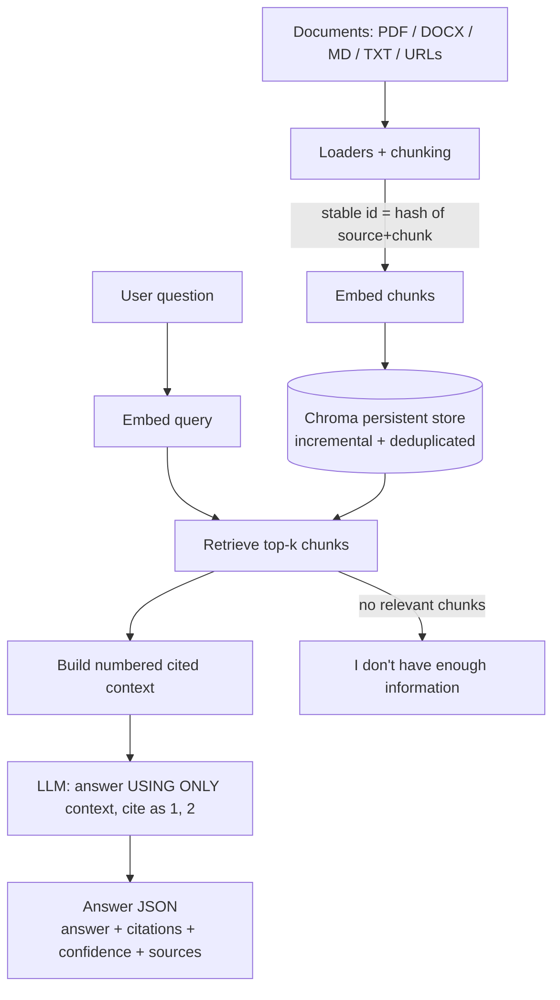

# RAG Knowledge Chatbot

> Upload your documents — PDFs, Word files, Markdown, text, or web pages — and get
> a chatbot that answers questions about them and **cites the exact source** for
> every claim. No more digging through a shared drive to find the one paragraph
> that answers a customer's question.
>
> Built by **[Lumifie Consulting](https://github.com/jarvis2017/lumifie-ai-agents)** on [`lumifie-core`](../lumifie-core) • MIT licensed

## The Business Problem

Every business sits on a pile of documents that hold the answers people need —
the employee handbook, the refund policy, product manuals, the FAQ, contracts,
onboarding guides. But that knowledge is locked in files. When a customer asks
"what's your return window?" or a new hire asks "how many vacation days do I
get?", someone has to remember which document it's in, open it, and skim for the
answer. Multiply that by every question, every day, and it's hours of repetitive
work — and inconsistent answers when different people interpret the same document
differently.

The usual "fix" is a generic chatbot. The problem is that generic chatbots make
things up. For a business, a confident wrong answer about a refund or a contract
term is worse than no answer at all, because nobody can tell which answers to
trust.

This agent solves both problems. You point it at your documents and it builds a
searchable knowledge base. When someone asks a question, it finds the most
relevant passages and answers **using only those passages**, with an inline
citation — `[1]`, `[2]` — after every claim, plus the source file and page. If the
documents don't contain the answer, it says so instead of guessing. Your team and
your customers get fast, consistent, **verifiable** answers, and you can click
straight through to the source.

## Who This Is For

- **Support & success teams** answering the same product/policy questions all day
- **HR & People Ops** fielding handbook, benefits, and policy questions
- **Operations & RevOps** turning SOPs and playbooks into a self-serve assistant
- **Professional services** (legal, accounting, consulting) querying their own docs
- **Any SMB** that wants a trustworthy "ask our documents" assistant, not a guessing bot

## How It Works



Ingestion is **incremental**: adding documents never rebuilds the index, and
re-ingesting the same content is skipped (chunk ids are content hashes). The
chatbot's **confidence** is derived from retrieval similarity — the average of the
top hits' `1 / (1 + distance)` scores — so a thin retrieval yields low confidence.

## Agent Architecture

| Module | Role | Inputs | Outputs | Tools / deps |
|---|---|---|---|---|
| `loaders.py` | Load & chunk docs/URLs with provenance | path/URL | `Chunk[]` | `pypdf`, `python-docx`, `beautifulsoup4`, `httpx` |
| `embeddings.py` | Embedding backends + auto-fallback | text | vectors | `sentence-transformers` (extra) / hashing |
| `store.py` | Persistent Chroma store (incremental, dedup) | `Chunk[]`, query | `IngestResult`, `Retrieved[]` | `chromadb` |
| `chatbot.py` | Retrieve → cite context → answer | question | `Answer` | `lumifie_core` |
| `stub.py` | Offline rule-based provider (cites top chunk) | messages | `CompletionResult` | — |
| `factory.py` | Wire embedding + store + provider; stub fallback | settings | `RagChatbot` | `lumifie_core` |
| `api.py` | Async FastAPI: `/ingest`, `/ask`, `/health` | JSON | `Answer` / `IngestResult` | `fastapi` |
| `cli.py` | `ingest` / `ask` / `serve` / `demo` / `ui` | CLI args | console / server | — |
| `ui.py` | Optional Gradio app | — | web UI | `gradio` (extra) |
| `models.py` | Typed models + answer schema | — | Pydantic models | `pydantic` |
| `config.py` | Settings (db path, chunking, top-k, embedding) | env | `ChatbotSettings` | `lumifie_core.CoreSettings` |

The answer is produced via `lumifie_core.BaseAgent.structured` — native tool use
where supported, JSON-mode fallback otherwise — so any litellm model works.

## Example Output

Run `rag-chatbot demo` (no key needed). You get a cited `Answer`.
**JSON** (`examples/example_answer.json`, abridged):

```json
[
  {
    "question": "How many vacation days do employees get and how do I request them?",
    "answer": "Based on the provided documents: Full-time employees accrue 20 days of paid vacation per year ... To request vacation, submit the request through the HR portal at least two weeks in advance [1].",
    "citations": [
      {
        "n": 1,
        "source": "remote_work_policy.md",
        "page": null,
        "chunk": 5,
        "snippet": "Full-time employees accrue 20 days of paid vacation per year, accrued monthly..."
      }
    ],
    "confidence": 0.34,
    "used_sources": ["remote_work_policy.md"]
  }
]
```

**Markdown summary** (`examples/example_answer.md`, excerpt):

```markdown
## Q: What is the return and refund policy?
Based on the provided documents: Unused items ... may be returned within 30 days
of delivery for a full refund ... [1]

_Confidence: 0.31 | sources: company_faq.md_
- [1] company_faq.md (chunk 3): Unused items in their original packaging may be returned within 30 days...
```

## Technical Stack


| Layer | Choice |
|---|---|
| Language | Python 3.12+ |
| Shared foundation | `lumifie-core` |
| API | FastAPI (async) + uvicorn |
| LLM access | litellm — Claude, OpenAI, Ollama |
| Default model | `claude-opus-4-8` |
| Vector DB | **Chroma** (`PersistentClient`, incremental + deduplicated) |
| Embeddings | sentence-transformers (`all-MiniLM-L6-v2`, extra `[st]`) → offline hashing fallback |
| Loaders | pypdf, python-docx, BeautifulSoup, httpx |
| UI (optional) | Gradio (extra `[ui]`) |
| Tests / lint | pytest + FastAPI TestClient / ruff |

## Setup & Usage

You need Python 3.12+ and [uv](https://github.com/astral-sh/uv).

```bash
# See it work IMMEDIATELY — no API key, no heavy deps:
python main.py demo

# Full setup:
uv pip install -e ../lumifie-core        # shared core (once)
cd rag-knowledge-chatbot
uv venv --python 3.12
uv pip install -e ".[dev]"

# Ingest your own documents (files and/or URLs), then ask:
rag-chatbot ingest handbook.pdf policy.docx notes.md https://example.com/faq
rag-chatbot ask "What is our refund window?"

# Run the API server:
rag-chatbot serve --port 8000
curl -s localhost:8000/ask -H 'content-type: application/json' \
  -d '{"question":"How many vacation days do employees get?"}'
```

**Production embeddings (semantic):** the default embedding is a deterministic
offline hashing backend so everything runs with zero downloads. For real semantic
recall, install the optional extra and the backend is auto-selected:

```bash
uv pip install -e ".[st]"   # sentence-transformers (pulls torch)
```

**Optional browser UI:**

```bash
uv pip install -e ".[ui]"   # gradio
rag-chatbot ui              # errors gracefully if gradio isn't installed
```

With no API key the chatbot uses a built-in **offline rule-based provider** that
composes a cited answer from the top retrieved passages, so `demo` and `ask` work
instantly. Set `ANTHROPIC_API_KEY` (or another) to use a real model.

Run the offline test suite: `pytest`

## Configuration

| Variable | Description | Default |
|---|---|---|
| `LITELLM_MODEL` | Model alias/id: `claude`, `gpt-4o`, `ollama/llama3.1`, … | `claude` |
| `ANTHROPIC_API_KEY` | Required for Claude models (omit to use offline stub) | — |
| `OPENAI_API_KEY` | Required for GPT models | — |
| `OLLAMA_API_BASE` | Ollama endpoint | `http://localhost:11434` |
| `LUMIFIE_MAX_TOKENS` | Max output tokens per call | `8000` |
| `LUMIFIE_MAX_RETRIES` | Retry attempts on transient API errors | `4` |
| `LUMIFIE_LOG_LEVEL` | Log level | `INFO` |
| `RAG_DB_PATH` | Chroma persistence directory | `./chroma_rag` |
| `RAG_COLLECTION` | Chroma collection name | `documents` |
| `RAG_CHUNK_SIZE` | Characters per chunk | `1000` |
| `RAG_CHUNK_OVERLAP` | Character overlap between chunks | `150` |
| `RAG_TOP_K` | Chunks retrieved per question | `4` |
| `RAG_EMBEDDING` | Backend: `auto`, `sentence-transformers`, `hashing` | `auto` |
| `RAG_ST_MODEL` | sentence-transformers model id (extra `[st]`) | `all-MiniLM-L6-v2` |
| `RAG_USER_AGENT` | User-Agent for URL fetches | `lumifie-rag-chatbot/0.1` |

CLI flags `--model`, `--db`, `--top-k`, and `--log-level` override the env values.

## Supported Models

| Capability | Claude (`claude-opus-4-8`) | OpenAI (`gpt-4o`) | Ollama (`ollama/*`) | Offline stub |
|---|---|---|---|---|
| Cited answering | ✅ Full (tool use) | ✅ Full (tool use) | 🟡 Partial (JSON) | ✅ Quotes top chunk |
| Retrieval (Chroma) | ✅ Full | ✅ Full | ✅ Full | ✅ Full |
| Confidence scoring | ✅ Full | ✅ Full | ✅ Full | ✅ Full |
| Incremental ingest | ✅ Full | ✅ Full | ✅ Full | ✅ Full |
| Semantic embeddings | ✅ via `[st]` | ✅ via `[st]` | ✅ via `[st]` | ✅ hashing fallback |
| Async API | ✅ Full | ✅ Full | ✅ Full | ✅ Full |

**Full** = native tool use; **Partial** = JSON-mode fallback with a logged warning;
**Offline stub** = the zero-setup rule-based provider used when no key is configured.

## Limitations & Roadmap

**Limitations**

- The offline stub composes answers by quoting the top retrieved chunk(s) — great
  for the demo and tests, but use a real model for synthesis across passages.
- The default hashing embedding is lexical, not semantic; install the `[st]` extra
  for paraphrase-robust retrieval.
- Confidence is a retrieval-similarity heuristic, not a calibrated probability.
- Loaders cover PDF, DOCX, Markdown, text, and HTML pages; scanned/image-only PDFs
  need OCR (not included), and JS-rendered pages may not extract cleanly.

**Roadmap**

- Re-ranking and hybrid (keyword + vector) retrieval for sharper top-k.
- Per-source access control and multi-tenant collections.
- Streaming answers and a conversational follow-up memory.
- OCR ingestion for scanned PDFs and image documents.
- Answer-grounding checks that flag any claim without a supporting citation.

---

MIT © 2026 Lumifie Consulting.
