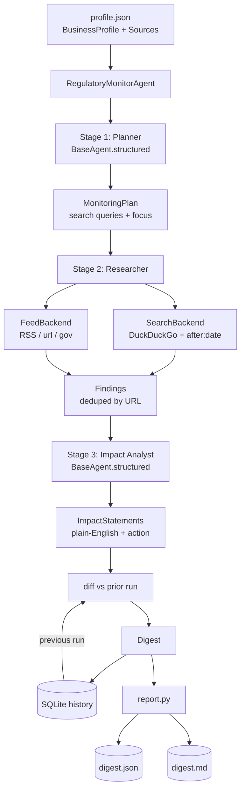

# Regulatory Monitor Agent

> Your standing early-warning system for regulatory change. Tell it what your
> business does and where; it watches the rules that affect you, translates new
> developments into plain English, and each week tells you **what's new and what
> to do about it**.
>
> Built by **[Lumifie Consulting](https://github.com/jarvis2017/lumifie-ai-agents)** on [`lumifie-core`](../lumifie-core) • MIT licensed

## The Business Problem

Regulations change constantly, and falling behind is expensive. A restaurant owner
in California has to track minimum-wage updates, tipped-wage rules, food-safety
requirements, and health-inspection changes — each set by a different agency, each
written in dense legal language, each landing without warning. Miss one and the cost
is real: fines, failed inspections, back-pay claims, or a forced scramble to comply
at the last minute.

Staying on top of it properly is a job nobody has time for. You'd have to check a
handful of government pages and newsletters every week, read through legalese, work
out whether each change actually applies to *your* business, and remember what you
already saw last time so you only act on what's genuinely new. Most owners simply
can't, so they find out about a rule change when a customer, an inspector, or a
lawyer tells them — far too late.

This agent does that weekly chore for you and, crucially, **remembers**. Give it a
short profile of your business and a few sources to watch; it searches for recent
regulatory updates, fetches your sources, and rewrites each relevant change into
plain English tailored to your industry and location — with a concrete recommended
action. Run it again next week and the digest opens with a **"New This Week"**
section containing only what's changed since last time. Point it at a cron schedule
and it becomes a quiet, always-on compliance radar for a few cents a run.

## Who This Is For

- **Small-business owners** in regulated industries (food service, hospitality, retail, childcare)
- **Operations & compliance managers** tracking obligations across locations
- **HR & payroll teams** watching wage, leave, and labor-law changes
- **Franchise operators** monitoring rules across multiple jurisdictions
- **Bookkeepers, accountants & consultants** delivering compliance monitoring as a service

## How It Works



## Agent Architecture

| Module | Role | Inputs | Outputs | Tools / deps |
|---|---|---|---|---|
| `agent.py` | 3-stage pipeline (plan → research → analyze → diff → assemble) | profile, sources, prior run | `Digest` | `lumifie_core.BaseAgent.structured`, `LLMProvider` |
| `schemas.py` | JSON schemas for the planner & analyst structured calls | — | tool/JSON schemas | — |
| `sources.py` | Web search + feed fetch behind injectable protocols | query / feed url | `SearchResult[]`, `FeedItem[]` | `ddgs`, `feedparser` |
| `store.py` | Persist each run, fetch latest prior run | `Digest` | run id / prior `Digest` | `sqlite3` |
| `diff.py` | New-detection vs the previous run (by URL fingerprint) | prev + current impacts | new `ImpactStatement[]` | — |
| `report.py` | Render digest (New This Week + Full Watchlist) | `Digest` | `.json`, `.md` | — |
| `models.py` | Typed pipeline data | stage I/O | `BusinessProfile`, `MonitoringPlan`, `Finding`, `ImpactStatement`, `Digest` | `pydantic` |
| `loader.py` | Load + validate the profile/sources JSON | file path | `MonitoringConfig` | `pydantic` |
| `config.py` | Settings (model, lookback, search limits, db path) | env / flags | `MonitorSettings` | `lumifie_core.CoreSettings` |
| `cli.py` | Entry point; load → run → diff → render | CLI args | digest files | `lumifie_core` |

**Structured LLM stages:** the **Planner** (`monitoring_plan`) and **Impact Analyst**
(`impact_analysis`) each use `BaseAgent.structured()` — a forced tool call on
Claude/GPT-4o, JSON-mode on Ollama. The **Researcher** stage is deterministic
(search + feed fetch), so it never hallucinates findings.

## Example Output

**JSON** (`examples/…digest.json`, abridged — mirrors the Markdown layout):

```json
{
  "business": { "industry": "food service", "location": "California, USA" },
  "run_date": "2026-06-21",
  "lookback_days": 7,
  "is_baseline": false,
  "new_this_week": [
    {
      "title": "New food-handler certification rule (30-day deadline)",
      "url": "https://www.cdph.ca.gov/news/2026/food-handler-rule",
      "relevance": "high",
      "plain_english": "CDPH now requires every food handler to complete updated certification within 30 days of hire...",
      "recommended_action": "Add certification to onboarding and track completion dates per employee."
    }
  ],
  "full_watchlist": [ { "title": "California fast-food minimum wage rises to $20.50/hour", "relevance": "high" } ]
}
```

**Markdown summary** (`examples/…digest.md`, excerpt):

```markdown
# Regulatory Digest — food service (California, USA)

**Lookback window:** last 7 day(s)

## 🆕 New This Week
### 1. 🔴 High — New food-handler certification rule (30-day deadline) · 2026-06-19
CDPH now requires every food handler to complete updated certification within 30
days of hire. With three locations and regular hourly turnover, you need a tracking
process so new hires are certified on time.

**Recommended action:** Add certification to onboarding, track completion dates per
employee, and verify all current staff hold a valid certificate.
```

## Technical Stack


| Layer | Choice |
|---|---|
| Language | Python 3.12+ |
| Shared foundation | `lumifie-core` |
| LLM access | litellm — Claude, OpenAI, Ollama |
| Default model | `claude-opus-4-8` |
| Web search | DuckDuckGo via `ddgs` (no API key); injectable backend |
| Feeds | RSS/Atom via `feedparser`; injectable backend |
| Persistence / diff | SQLite (`sqlite3`) |
| Data models | Pydantic 2 |
| Tests / lint | pytest / ruff |

## Setup & Usage

You need Python 3.12+ and [uv](https://github.com/astral-sh/uv).

```bash
# 1. From the repo root, install the shared core (once):
uv pip install -e ./lumifie-core

# 2. Set up this agent:
cd regulatory-monitor-agent
uv venv --python 3.12
uv pip install -e ".[dev]"

# 3. Add your API key:
cp .env.example .env          # set ANTHROPIC_API_KEY=sk-ant-...
set -a; . ./.env; set +a

# 4. Run it:
reg-monitor --profile config/profile.example.json \
            --out-dir ./reports --print
```

The profile file holds your business profile **and** the sources to watch (see
`config/profile.example.json`). Run it again later and the digest's **"New This
Week"** section fills in automatically from the SQLite history.

**Scheduled (cron):**

```bash
chmod +x scripts/run_scheduled.sh
# Every Monday 07:00 (weekly digest):
# 0 7 * * 1 cd /opt/regulatory-monitor-agent && \
#   scripts/run_scheduled.sh config/profile.example.json >> /var/log/reg-monitor.log 2>&1
```

Regenerate the committed example (runs the real pipeline against offline fakes):
`python scripts/generate_example_output.py`

Run the offline test suite (no API key, no network): `pytest`

## Configuration

| Variable | Description | Default |
|---|---|---|
| `LITELLM_MODEL` | Model alias/id: `claude`, `gpt-4o`, `ollama/llama3.1`, … | `claude` |
| `ANTHROPIC_API_KEY` | Required for Claude models | — |
| `OPENAI_API_KEY` | Required for GPT models | — |
| `OLLAMA_API_BASE` | Ollama endpoint | `http://localhost:11434` |
| `LUMIFIE_MAX_TOKENS` | Max output tokens per call | `8000` |
| `LUMIFIE_MAX_RETRIES` | Retry attempts on transient API errors | `4` |
| `LUMIFIE_LOG_LEVEL` | Log level | `INFO` |
| `RM_DB_PATH` | SQLite history path (enables run-over-run diffs) | `reg_monitor.db` |
| `RM_SEARCH_REGION` | DuckDuckGo region | `us-en` |
| `RM_LOOKBACK_DAYS` | Days back to constrain searches (`after:` date) | `7` |
| `RM_MAX_QUERIES` | Max planner search queries run per digest | `6` |
| `RM_RESULTS_PER_SEARCH` | Results fetched per query | `5` |
| `RM_MAX_FINDINGS` | Cap on findings handed to the analyst | `40` |

CLI flags (`--model`, `--lookback-days`, `--db`, `--region`, `--out-dir`,
`--reasoning-effort`, `--print`, `--log-level`) override the corresponding env
values for a single run.

## Supported Models

| Capability | Claude (`claude-opus-4-8`) | OpenAI (`gpt-4o`) | Ollama (`ollama/*`) |
|---|---|---|---|
| Stage 1 — planner (structured) | ✅ Full (tool use) | ✅ Full (tool use) | 🟡 Partial (JSON mode) |
| Stage 2 — researcher (search + feeds) | ✅ Full | ✅ Full | ✅ Full |
| Stage 3 — impact analyst (structured) | ✅ Full (tool use) | ✅ Full (tool use) | 🟡 Partial (JSON mode) |
| SQLite diff / "New This Week" | ✅ Full | ✅ Full | ✅ Full |
| Scheduled (cron) runs | ✅ Full | ✅ Full | ✅ Full |

**Full** = native tool use; **Partial** = JSON-mode structured extraction with a
logged warning. The researcher stage is deterministic and identical across models.

## Limitations & Roadmap

**Limitations**

- This is **informational, not legal advice** — always verify a change with the
  primary source or a professional before acting.
- Web coverage reflects what DuckDuckGo returns at run time; niche or very recent
  rules may not surface, and the analyst reasons from snippets/feed summaries rather
  than full statutory text.
- New-detection is by source URL: if an agency reissues the same rule at a new URL,
  it will appear as new.
- Date filtering depends on search engines honoring the `after:` constraint and on
  feeds publishing accurate dates.

**Roadmap**

- Full-page reads of linked regulations (fetch + parse the actual rule text).
- Pluggable premium search backends (Tavily, SerpAPI) behind the same protocol.
- Email/Slack delivery of the weekly digest on each scheduled run.
- Severity/deadline extraction (e.g. effective dates) and a compliance calendar.
- Trend view across the full SQLite history (what changed month over month).

---

MIT © 2026 Lumifie Consulting.
