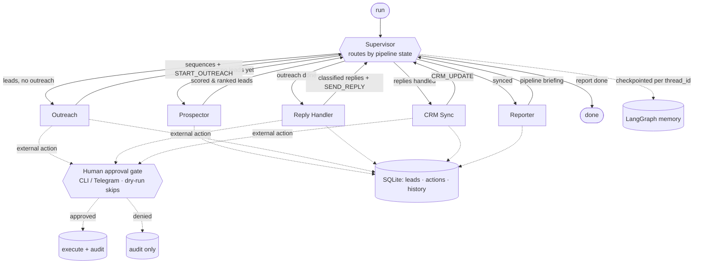

# Sales-Ops Multi-Agent

> A LangGraph **supervisor** that runs your entire outbound sales cycle — find leads,
> personalize outreach, handle replies, keep the CRM in sync, and report — with a
> **human approval gate before anything leaves the building**.
>
> Built by **[Lumifie Consulting](https://github.com/jarvis2017/lumifie-ai-agents)** on [`lumifie-core`](../lumifie-core) • MIT licensed • the portfolio showpiece

## The Business Problem

A sales development rep (SDR) costs roughly **$60,000–$80,000 a year** fully loaded —
salary, benefits, tooling, ramp, and management — and a big chunk of that budget pays
for work that is repetitive and rules-based: building lead lists, researching each
company, writing "personalized" emails, sorting replies into interested / not-now /
wrong-person, and updating the CRM after every touch. A typical SDR spends more time
on this busywork than on the judgment calls that actually need a human. Worse, the
output is uneven: lists go stale, follow-ups slip, and CRM hygiene decays the moment
things get busy — so pipeline leaks and you pay for it twice.

This agent does the repetitive 80% and hands a human the 20% that matters. A
supervisor coordinates five specialized sub-agents to run the full cycle end to end:
it prospects and scores leads against your ideal-customer profile, drafts genuinely
personalized multi-step outreach from live signals, triages every reply, keeps
HubSpot/Airtable current automatically, and produces a daily pipeline briefing with
conversion metrics, stale deals, and recommended next actions. It runs on commodity
LLM pricing — **dollars per run, not thousands per month.**

Critically for a CFO: **nothing risky is autonomous.** Every external action — every
email send, every CRM write, every reply — stops at a human approval gate (CLI or
Telegram) before it fires, and a full SQLite audit trail records who approved what. A
**dry-run mode** shows exactly what the system *would* do before you ever turn it on.
You get the leverage of an always-on SDR with tighter control than a human one — and
you can reallocate that $60k headcount budget to closers, not list-builders.

## Who This Is For

- **Founders & CFOs** weighing the cost of an SDR hire against an automated alternative
- **Sales leaders / RevOps** standardizing prospecting, outreach, and CRM hygiene
- **Agencies** running outbound for many clients from one controlled system
- **Lean teams** that need pipeline coverage without headcount

## How It Works



The supervisor loops: it inspects pipeline state, routes to the next sub-agent, and
each sub-agent returns control to the supervisor until the report is produced. Every
external action a sub-agent proposes flows through the single approval gate.

## Agent Architecture

| Component | Role | Inputs | Outputs | Tools / deps |
|---|---|---|---|---|
| **Supervisor** (`supervisor.py`) | Routes between sub-agents by pipeline state; checkpoints memory | `SalesState` | next node | `langgraph` StateGraph + `MemorySaver` |
| **Prospector** (sub-agent) | Find → enrich → score & rank leads vs ICP | ICP | `ScoredLead[]` | `lumifie_core.web` search + reader, `structured()` |
| **Outreach** (sub-agent) | Craft personalized email+LinkedIn sequences | `ScoredLead` | `OutreachSequence` | `structured()` |
| **Reply Handler** (sub-agent) | Classify replies, route by intent | `Reply` | classified `Reply` | `structured()` |
| **CRM Sync** (sub-agent) | Upsert leads/stages to HubSpot/Airtable | `ScoredLead` | CRM writes | `CRMClient` (httpx) |
| **Reporter** (sub-agent) | Daily metrics, stale deals, next actions | state + history | `PipelineReport` | `structured()` |
| `agent.py` | Orchestrator: nodes + the single approval-gated execution path | — | `PipelineResult` | `lumifie_core.BaseAgent` |
| `approval.py` | Human gate: CLI / auto / deny / **Telegram** | `ProposedAction` | bool | `httpx` (Telegram) |
| `store.py` | Durable pipeline/lead/action persistence + stale detection | — | SQLite | `sqlite3` |
| `config.py` | YAML business config (ICP, approval, CRM, outreach) | YAML | `SalesOpsConfig` | `pyyaml` |

Pydantic models back every state transition (`models.py`); the LangGraph state lives
in `state.py`.

## Example Output

`sales-ops run --demo --dry-run --print` runs the whole pipeline offline. JSON
(`examples/demo-pipeline.pipeline.json`, abridged):

```json
{
  "pipeline_id": "demo-pipeline",
  "dry_run": false,
  "leads": [
    { "rank": 1, "company": "Acme Analytics", "icp_fit": 88, "tier": "A", "stage": "qualified" }
  ],
  "report": {
    "metrics": { "leads_prospected": 3, "sequences_drafted": 3, "replies_processed": 2, "actions_executed": 8 },
    "recommended_next_actions": ["Book the interested A-tier lead before momentum fades."]
  },
  "actions": [
    { "type": "start_outreach", "lead_id": "lead-1", "decision": "executed" },
    { "type": "crm_update", "lead_id": "lead-1", "decision": "executed" }
  ]
}
```

Markdown briefing (`examples/demo-pipeline.pipeline.md`, excerpt):

```markdown
# Sales Pipeline Briefing — demo-pipeline

## Pipeline Metrics
- Leads prospected: 3
- Actions executed: 8 / 8 proposed

## Action Log (approval-gated)
- ✅ `start_outreach` [lead-1] — executed: sent step 1 to jane@acme-analytics.com
- ✅ `crm_update` [lead-1] — executed: crm upsert Acme Analytics -> qualified
```

## Technical Stack


| Layer | Choice |
|---|---|
| Language | Python 3.12+ |
| Shared foundation | `lumifie-core` |
| Orchestration | **LangGraph** supervisor (`StateGraph`) + `MemorySaver` checkpointing |
| LLM access | litellm — Claude, OpenAI, Ollama |
| Default model | `claude-opus-4-8` |
| Persistence | SQLite (pipeline state, lead history, action audit) |
| Web research | `lumifie_core.web` (DuckDuckGo + Jina Reader) |
| CRM | HubSpot / Airtable (httpx); Fake for demo |
| Approvals | CLI (default) or Telegram |
| Config | YAML (`pyyaml`) |

## Setup & Usage

```bash
# 1. Shared core (once), then this agent:
uv pip install -e ../lumifie-core
cd sales-ops-multi-agent
uv venv --python 3.12 && uv pip install -e ".[dev]"

# 2. See it run immediately — offline, no key, nothing executed:
sales-ops run --demo --dry-run --print

# 3. Real run with your config (gated; approve each external action in the CLI):
cp .env.example .env          # set ANTHROPIC_API_KEY and CRM creds
set -a; . ./.env; set +a
sales-ops run --config config/sales_ops.example.yaml --print
```

```
sales-ops run [--config FILE] [--demo] [--dry-run] [--yes]
              [--db PATH] [--model ...] [--out-dir DIR] [--print]
```

- `--dry-run` proposes + audits everything, executes nothing.
- default = interactive CLI approval per external action; `--yes` auto-approves;
  set `approval.channel: telegram` (+ `TELEGRAM_BOT_TOKEN`) for remote approvals.

Run the offline test suite: `pytest`

## Configuration

YAML business config (see `config/sales_ops.example.yaml`): `icp`, `approval`
(`cli`/`auto`/`deny`/`telegram` + `telegram_chat_id`), `crm` (`none`/`hubspot`/
`airtable`), `outreach` (tone/steps/channels), `max_leads`, `stale_after_days`.

Environment (`.env.example`):

| Variable | Description | Default |
|---|---|---|
| `LITELLM_MODEL` | Model alias/id (`claude`, `gpt-4o`, `ollama/llama3.1`) | `claude` |
| `ANTHROPIC_API_KEY` / `OPENAI_API_KEY` | Model credential (omit → offline stub) | — |
| `SALESOPS_CONFIG` | Path to the YAML business config | unset |
| `SALESOPS_DB` | SQLite path | `sales_ops.db` |
| `TELEGRAM_BOT_TOKEN` | For `approval.channel: telegram` | — |
| `HUBSPOT_TOKEN` | CRM Sync (HubSpot) | — |
| `AIRTABLE_API_KEY` / `AIRTABLE_BASE_ID` / `AIRTABLE_TABLE` | CRM Sync (Airtable) | — |
| `SMTP_HOST` / `SMTP_PORT` / `SMTP_USER` / `SMTP_PASSWORD` / `SMTP_FROM` | Real outbound email (optional) | — |
| `LUMIFIE_MAX_TOKENS` / `LUMIFIE_LOG_LEVEL` | Shared core knobs | `8000` / `INFO` |

## Supported Models

| Capability | Claude (`claude-opus-4-8`) | OpenAI (`gpt-4o`) | Ollama (`ollama/*`) | Offline stub |
|---|---|---|---|---|
| Prospect scoring | ✅ Full (tool use) | ✅ Full | 🟡 Partial (JSON) | ✅ Rule-based |
| Outreach copywriting | ✅ Full | ✅ Full | 🟡 Partial | ✅ Templated |
| Reply classification | ✅ Full | ✅ Full | 🟡 Partial | ✅ Rule-based |
| Reporting/summary | ✅ Full | ✅ Full | 🟡 Partial | ✅ Templated |
| Supervisor / approval gate / CRM / SQLite | ✅ Full | ✅ Full | ✅ Full | ✅ Full |

**Full** = native tool use; **Partial** = JSON-mode fallback with a warning;
**Offline stub** = the zero-setup provider used when no key is configured.

## Limitations & Roadmap

**Limitations**

- Outbound email and inbox reading use injectable backends; the default build ships a
  recording email sender + seeded mailbox (real SMTP/IMAP/provider hooks are
  one-class swaps). Real send/inbox wiring is a deploy-time integration.
- LangGraph checkpointing uses the in-memory saver by default; swap `SqliteSaver` for
  durable cross-process checkpoints.
- The offline stub is for demos/tests — use a real model in production.

**Roadmap**

- `SqliteSaver` checkpointer + resume-a-paused-pipeline from the CLI.
- Gmail/Outlook inbox adapters and a real ESP send path behind the same protocols.
- Two-way Telegram control (approve, edit, or reschedule from chat).
- Conversion analytics across runs (reply rates, stage velocity) in the Reporter.

---

MIT © 2026 Lumifie Consulting.
